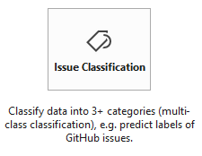
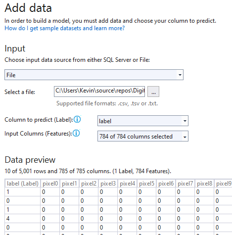
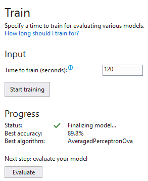
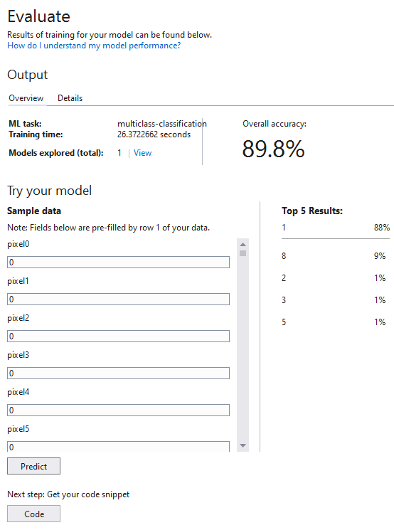

# The Kaggle Digit Recognizer problem in Machine Learning using ML.NET and Model Builder

I have already implemented this solution twice in [Python], once hand-coded and once with scikit-learn. Here is a .NET version using Microsoft's ML.NET framework with Model Builder, an automated machine learning tool.

ML.NET gives you the ability to add machine learning to .NET applications. Model Builder (still in preview at the time of posting) is a graphical Visual Studio extension to build, train, and deploy custom machine learning models.

It uses automated machine learning (AutoML) to explore different machine learning algorithms and settings to help you find the one that best suits your scenario.

For the Digit Recognizer problem, these were the Model Builder steps.

#### Step 1

#### Step 2

#### Step 3

#### Step 4

[Python]: <https://github.com/kevinmcfarlane/digit-recognizer>

#### Step 5

Consume the generated code (in the DigitsRecognizerML project).

The other two projects are the model and an application showing you how to consume the model in your own application.
